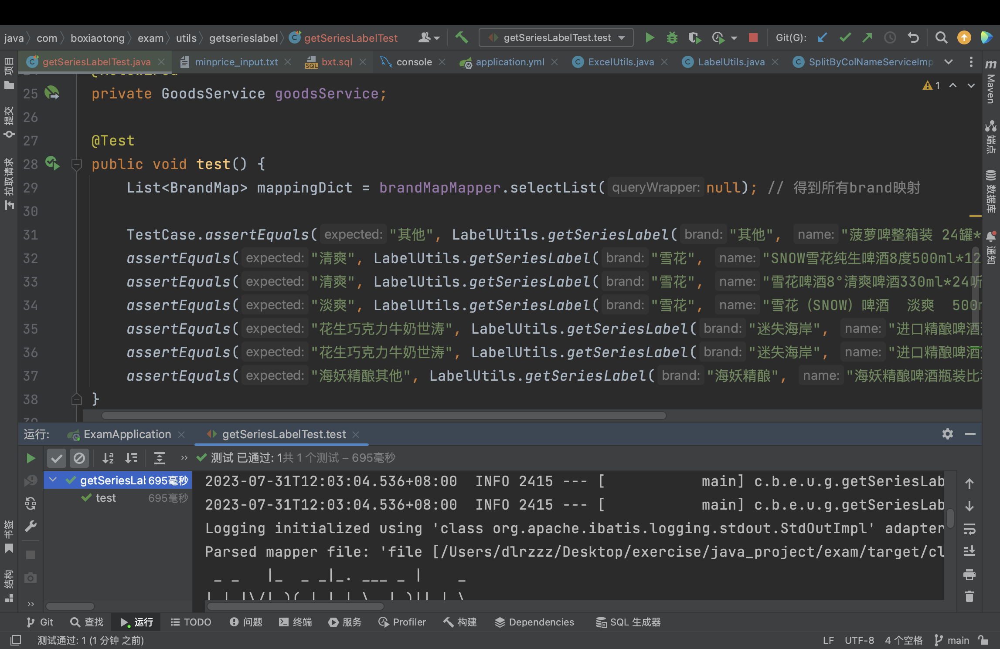
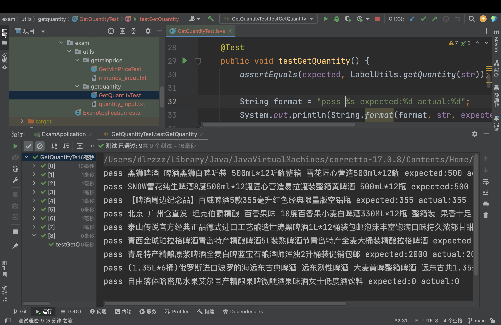
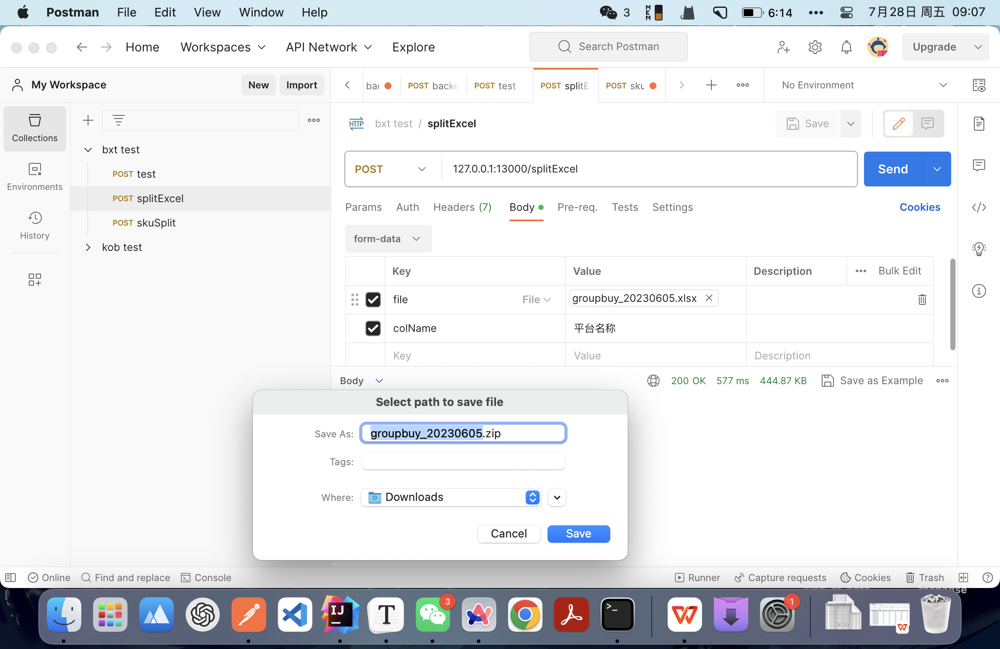
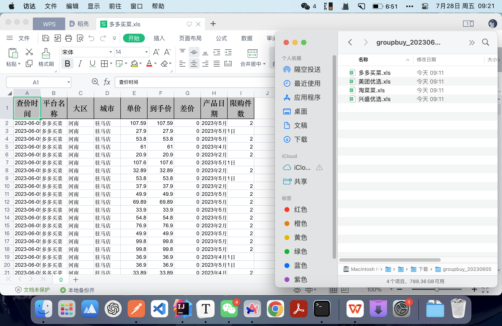
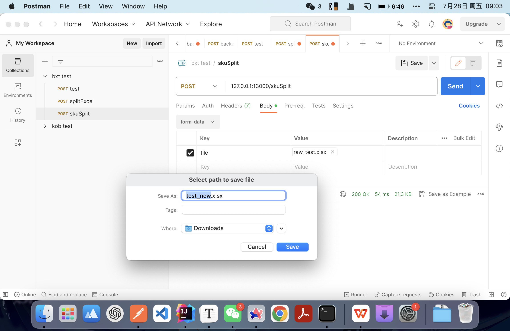
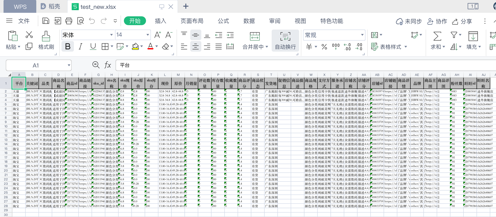

<h2 style="text-align:center">博晓通笔试题</h2>

### 数据处理工作

#### 打标签--系列

#### 打标签--单量

单元测试结果：

#### 基于促销信息 计算最低到手价

单元测试结果：

### Excel操作

#### 按列拆分成多个Excel

1. 按列拆分表
   
   测试结果：
   
   
   
   
   
2. 可以制作一个简易Web页面，将api放上去，方便运营人员调用，且易于后期在Web页面中添加拓展的api。

#### SKU分裂

测试结果：

